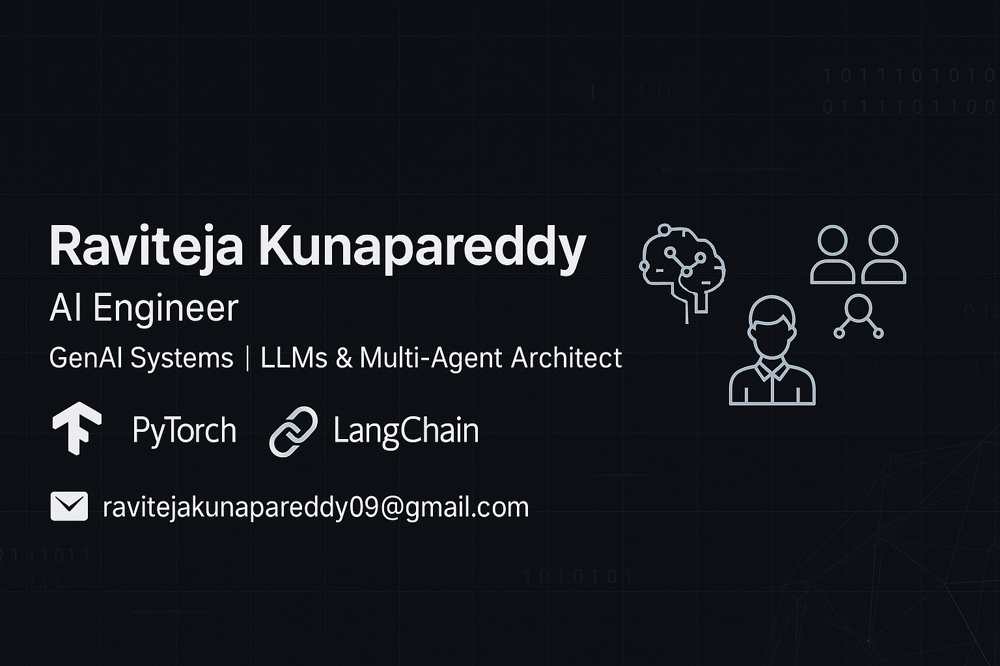

<p align="center">
  
</p>

<div align="center">
  
  
  
</div>

---

# 👋 Hey, I’m Raviteja Kunapareddy

AI Engineer focused on building systems that actually work in the real world — whether it’s fine-tuning LLMs, optimizing retrieval pipelines, or creating multi-agent tools that think before they act.

🎓 Master’s in MIS @ Northern Illinois University  
💼 Former AI Engineer @ TCS (AWS, MLOps, real-time NLP systems)  
🚀 Now building GenAI systems that are usable, safe, and deployable

---

## 🛠️ Tech Stack Snapshot

```
🧠 AI/ML → TensorFlow, PyTorch, Scikit-learn, LangChain, HuggingFace
🧩 GenAI → RAG, LoRA/QLoRA, Gemini API, CrewAI, LangGraph
⚙️ MLOps  → Docker, FastAPI, Airflow, SageMaker, Streamlit
📊 Data   → Pandas, Spark, SQL, Databricks, Power BI
```

---

## ✍️ Why I'm Building What I'm Building

Right now, every project I’m working on is part of a bigger goal:

- I’m learning how to fine-tune LLMs (with LoRA/QLoRA) on real data — not toy datasets — so they can actually be useful in finance or healthcare.
- I’m exploring agent frameworks like CrewAI and LangGraph to break problems into smaller, intelligent decisions.
- I'm improving retrieval pipelines — combining FAISS with keyword search — to reduce hallucinations and give more accurate answers.
- And I'm making sure everything I build can be monitored, logged, and controlled — because in high-risk domains, safety isn’t optional.

The goal isn’t just to build “cool AI.”  
It’s to build systems people can trust — and use.

---

## 🧠 Projects That Show the Work

### 🩺 [RAG-Based Healthcare Assistant](https://github.com/RaviKunapareddy/Raviteja-Kunapareddy-AI-Portfolio/tree/main/3_genai_systems/rag-healthcare-assistant)
Semantic search + Gemini-powered answer generation using medical Q&A data. Feedback logging, dynamic prompts, domain filters — built for real-world usage.

### 📈 [LLM Fine-Tuning on Financial Filings](#)
Finetuning LLaMA 2 using LoRA on SEC 10-Ks. Outputs structured JSON insights from unstructured documents. *(Coming Soon)*

### 🕸️ [AI Multi-Agent System](#)
CrewAI and LangGraph-based system to coordinate reasoning agents for research, planning, and execution. *(Coming Soon)*

### 🤖 [AI Intent Chatbot (TensorFlow)](https://github.com/RaviKunapareddy/AI-Chatbot)
A real-time chatbot using bag-of-words, intent classification, and response generation — solid NLP fundamentals in action.

### 🎬 [Movie Recommendation System (SVD)](https://github.com/RaviKunapareddy/Movie-Recommendation-System)
Matrix factorization on MovieLens dataset with top-N predictions — built with Surprise library.

### 🖼️ [CNN Image Classifier (CIFAR-10)](https://github.com/RaviKunapareddy/Image-Classifier)
High-accuracy image classifier trained from scratch using Keras. Clean architecture, saved model, and real-time prediction support.

---

## 📫 Let’s Connect

- 💼 [LinkedIn](https://www.linkedin.com/in/ravitejak99/)  
- 💻 [GitHub](https://github.com/RaviKunapareddy)  
- 📧 [ravitejakunapareddy09@gmail.com](mailto:ravitejakunapareddy09@gmail.com)

Let’s build something that actually matters.
